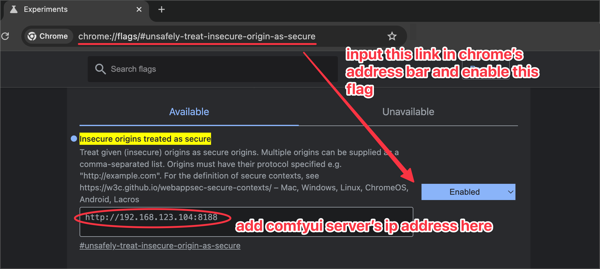

# ComfyUI Web Viewer

The **ComfyUI Web Viewer** by [vrch.ai](https://vrch.ai) is a custom node collection offering a real-time AI-generated interactive art framework. This utility integrates realtime streaming into ComfyUI workflows, supporting keyboard control nodes, OSC control nodes, sound input nodes, and more. Accessible from any device with a web browser, it enables real time interaction with AI-generated content, making it ideal for interactive visual projects and enhancing ComfyUI workflows with efficient content management and display.

**✨ Features:**

- **Real-Time AI Generation & Interaction**: Immediate response for interactive creativity.
- **Multi-Input Support**: Easily integrates keyboard, OSC, and audio input for versatile interactivity.
- **Universal Web Accessibility**: Compatible with any device equipped with a web browser.

**🚀 Support Us:**

If you find the **ComfyUI Web Viewer** useful or inspiring, consider supporting us:

- 💖 **Sponsor**: Help us maintain and enhance the project through [GitHub Sponsors](https://github.com/sponsors/VrchStudio).
- ⭐ **Star the Project**: A star on GitHub greatly motivates us and helps increase visibility!
- 📩 **Business Inquiries**: For commercial collaborations, reach us at [hi@vrch.io](mailto:hi@vrch.io?subject=ComfyUI%20Web%20Viewer%20-%20Commercial%20Inquiry).

<video src="https://github.com/user-attachments/assets/cdac0293-64ce-4b74-95a8-d4dcce2300d2" controls="controls" style="max-width: 100%;">
</video>

## Changelog

see [CHANGELOG](CHANGELOG.md)

## Installation

### Method 1: Auto Installation (Recommended)

Simply search for `ComfyUI Web Viewer` in ComfyUI Manager and install it directly.

### Method 2: Manual Installation

1. Clone this repo into the `custom_nodes` directory of ComfyUI
   ```
   git clone git@github.com:VrchStudio/comfyui-web-viewer.git
   ```
2. Install dependencies: 
   ```
   pip install -r requirements.txt
   ``` 
   or if you use the `windows` portable install, run this in `ComfyUI_windows_portable` folder:
   ```
   python_embeded\python.exe -m pip install -r ComfyUI\custom_nodes\comfyui-web-viewer\requirements.txt
   ```
3. Restart ComfyUI

## How to Use

### `Web Viewer Nodes`


- Documentation: [Usage of Web Viewer nodes](./docs/web_viewer_nodes.md)
- Example workflows: 
  - [Workflow Example: Image Web Viewer node](./example_workflows/example_web_viewer_001_image_web_viewer.json)
  - [Workflow Example: Image Flipbook Viewer node](./example_workflows/example_web_viewer_002_image_flipbook_web_viewer.json)
  - [Workflow Example: Video Web Viewer node (video only)](./example_workflows/example_web_viewer_003_video_web_viewer.json)
  - [Workflow Example: Video Web Viewer node (video + sound)](./example_workflows/example_web_viewer_004_video_web_viewer_video_with_sfx.json)
  - [Workflow Example: Audio Web Viewer node (voice clone)](./example_workflows/example_web_viewer_005_audio_web_viewer_f5_tts.json)
- Tutorials:
  - [Fast Image to Video by LTX Videos and Ollama](./docs/tutorial_002_fast_image_to_video_by_ltx_video_and_ollama.md)
  - [Fast Image to Video by LTX Vidoes, MMAudio and Ollama](./docs/tutorial_003_fast_image_to_video_by_ltx_video_and_mmaudio_and_ollama.md)
  - [Real Time Voice Clone](./docs/tutorial_004_real_time_voice_clone_by_f5_tts.md)
  - [Audio Picture Book with Your Own Voice](./docs/tutorial_006_srt_to_audio_picture_book.md)

### `WebSocket Web Viewer Nodes`

- Documentation: [Usage of WebSocket Viewer nodes](./docs/websocket_viewer_nodes.md)
- Example workflows: n/a
- Tutorials: n/a

### `OSC Control Nodes`

- Documentation: [Usage of OSC Control nodes](./docs/osc_control_nodes.md)
- TouchOSC Control Panel:
  - [comfyui_osc_control.tosc](./assets/touchosc/comfyui_osc_control.tosc)
- Example workflows:
  - [Workflow Example: OSC Control Nodes](./example_workflows/example_osc_control_001_basic.json)
  - [Workflow Example: Live Portrait + Gamepad](./example_workflows/example_osc_control_002_live_portrait_with_gamepad.json)
  - [Workflow Example: IC-Light](./example_workflows/example_osc_control_003_ic-light.png)
- Tutorials:
  - [Live Portrait + Gamepad](./docs/tutorial_001_live_portrait_with_gamepad.md)

### `Key Control Nodes`

- Documentation: [Usage of Key Control nodes](./docs/key_control_nodes.md)
- Example workflows:
  - [Workflow Example: Key Control Nodes](./example_workflows/example_key_control_001_basic.json)

### `Gamepad Nodes`

- Documentation: [Usage of Gamepad nodes](./docs/gamepad_nodes.md)
- Example workflows:
  - [Workflow Example: Gamepad Nodes](./example_workflows/example_gamepad_nodes_001_basic.json)
  - [Workflow Example: Gamepad with Live Portrait](./example_workflows/example_gamepad_nodes_002_live_portrait.json)

### `Audio Nodes`

- Documentation: [Usage of Audio nodes](./docs/audio_nodes.md)
- Example workflows:
  - [Workflow Example: Audio Recorder Node](./example_workflows/example_audio_nodes_001_audio_recorder.json)

### `Image Nodes`

- Documentation: [Usage of Image nodes](./docs/image_nodes.md)
- Example workflows:
  - [Workflow Example: Preview Image in Background](./example_workflows/example_image_nodes_001_preview_in_background.json)

### `Logic Nodes`

- Documentation: [Usage of Logic nodes](./docs/logic_nodes.md)
- Example workflows: n/a

### `Text Nodes`

- Documentation: [Usage of Text nodes](./docs/text_nodes.md)
- Example workflows:
    - [Workflow Example: Text SRT Player Node](./example_workflows/example_text_nodes_001_text_srt_player.json)
- Tutorials:
  - [Storytelling with Text SRT Player](./docs/tutorial_005_storytelling_with_text_srt_player.md)

### `Other Example Workflows`

- [Rapid Text to Image (8K)](./example_workflows/example_others_001_text_to_image_8k.json)
- [Auto Switch to Instant Queue and Run Workflow](./example_workflows/example_others_002_autorun_instant_queue.json)
- [Apple Vision Pro Ultrawide Wallpaper (5K)](./example_workflows/example_others_003_text_to_image_5k_avp_ultra_wide.json)
- [Audio Picture Book with Your Own Voice (FLUX version)](./example_workflows/example_others_004_srt_to_audio_picture_book.json)
- [Audio Picture Book with Your Own Voice (SDXL version)](./example_workflows/example_others_005_srt_to_audio_picture_book_sdxl.json)

## Troubleshootings

### 1. Image Not Displayed in Popped-Up Image Viewer Window

For Chrome, you may need to add the ComfyUI server's IP address manually in `chrome://flags/#unsafely-treat-insecure-origin-as-secure` to enable access to the content. For other browsers, an http-to-http setup should allow for seamless access without additional configuration.



---

### 2. How can I resolve the CORS policy error when trying to display images?

If you’re encountering a CORS policy error with a message like this:

> `"origin 'https://vrch.ai' has been blocked by CORS policy: No 'Access-Control-Allow-Origin' header is present on the requested resource"`

or

> `"WARNING: request with non matching host and origin 127.0.0.1 !=vrch.ai, returning 403"`

you can resolve this by launching the ComfyUI service with the `--enable-cors-header` flag appended. For example:

```bash
python main.py --enable-cors-header
```

For additional details, refer to [this discussion on GitHub](https://github.com/comfyanonymous/ComfyUI/pull/413#issuecomment-1499518110).

---

### 3. Why can’t the ComfyUI service run at HTTPS/TLS/SSL on port 8189?

`ComfyUI Web Viewer` provides a build-in, self-signed certificate (intended for development only, not production use). To launch the ComfyUI service with HTTPS enabled on port 8189, use the following command:

```bash
# Start ComfyUI with HTTPS using the built-in certificate and key
python main.py --tls-keyfile ./custom_nodes/comfyui-web-viewer/https/key.pem --tls-certfile ./custom_nodes/comfyui-web-viewer/https/cert.pem --port 8189 --listen
```

For more details, refer to the [ComfyUI official instructions](https://github.com/comfyanonymous/ComfyUI?tab=readme-ov-file#how-to-use-tlsssl).


## Version Update

This project uses `bump2version` for version management. To update the version:

1. Ensure you have `bump2version` installed:
   ```bash
   pip install bump2version
   ```
2. To update the version, run:
   ```bash
   python update_version.py [major|minor|patch]
   ```
   Replace `[major|minor|patch]` with the part of the version you want to increment.
3. This will automatically:
   - Update the version number in `__init__.py`
   - Update the CHANGELOG.md file
   - Create a new git commit and tag (if you're using git)
4. After running the script, review and update the CHANGELOG.md file with details about the new version's changes.
   - Note: make sure you've put changes in `Unreleased` section manually

## Contributing

Created and maintained by the [vrch.io](https://vrch.io) team.

Contributions are welcome! Please feel free to submit a Pull Request.

## Contact Us

For any inquiries, you can contact us at [hi@vrch.io](mailto:hi@vrch.io?subject=ComfyUI%20Web%20Viewer%20-%20General%20Inquiry).

## Star History

[](https://www.star-history.com/#VrchStudio/comfyui-web-viewer&Date)

## License

[MIT License](LICENSE)
