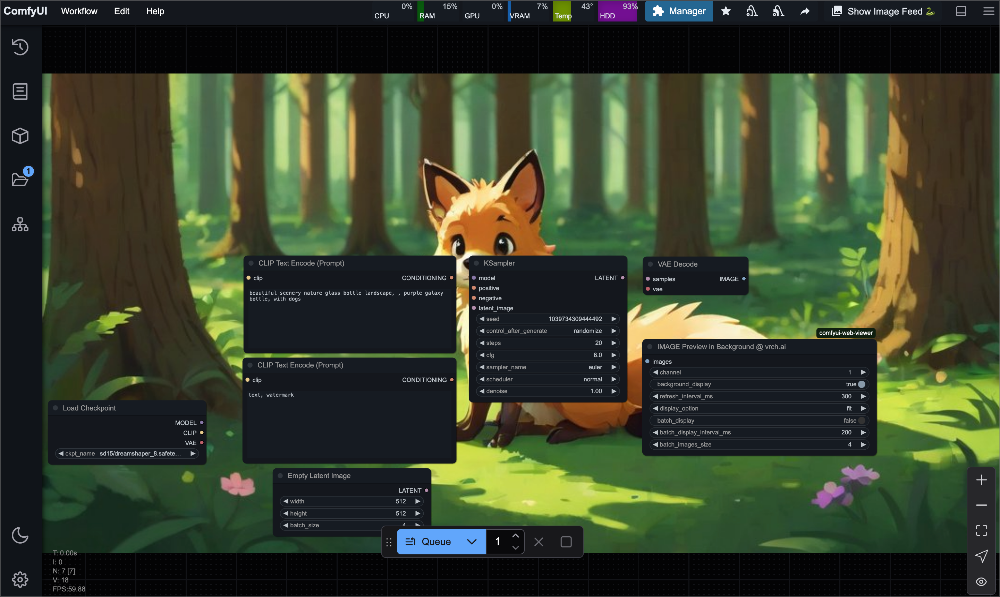

### Node: `IMAGE Saver @ vrch.ai` (vrch.ai/image)

1. **Add the `IMAGE Saver @ vrch.ai` node to your ComfyUI workflow.**

2. **Configure the Node:**
   - **Image Input:**
     - **`images`**: Provide one or more images to be saved.
   - **Filename:**
     - **`filename`**: Specify the base filename for saving the image(s). If multiple images are provided, an index will be appended (e.g., `web_viewer_image_00.jpeg`).
   - **Path:**
     - **`path`**: Define the subfolder within the ComfyUI output directory where the images will be saved (default is `web_viewer`).
   - **File Extension:**
     - **`extension`**: Choose the output image format from **`jpeg`**, **`png`**, or **`webp`** (default is **`jpeg`**).
   - **Quality Settings:**
     - **`quality_jpeg_or_webp`**: Set the quality for JPEG or WEBP images (default is **85**, valid range: **1–100**).
     - **`optimize_png`**: Enable PNG optimization when saving PNG images.
     - **`lossless_webp`**: Enable lossless compression for WEBP images.
   - **Preview Option:**
     - **`enable_preview`**: If enabled, the node will return preview information for the saved images.

3. **Save Images:**
   - The node saves the provided images into the specified subfolder under the ComfyUI output directory using the given filename and file extension.
   - When multiple images are provided, filenames will be automatically suffixed with an index.

---

### Node: `IMAGE Preview in Background (Legacy) @ vrch.ai` (vrch.ai/image)

#### 1. Adding the Node
Add the `IMAGE Preview in Background (Legacy) @ vrch.ai` node to your ComfyUI workflow.

#### 2. Node Configuration
- **Image Input:**
  - **`images`**: Provide a single image to be used for the background preview.
- **Channel:**
  - **`channel`**: Select a channel number from **"1"** to **"8"** (default is **"1"**). This determines the filename prefix (e.g., `channel_1.jpeg` or in batch mode `channel_1_00.jpeg`).
- **Background Display:**
  - **`background_display`**: Toggle to enable or disable displaying the image as a background in ComfyUI.
- **Refresh Interval:**
  - **`refresh_interval_ms`**: Set the interval (in milliseconds) for refreshing the background preview (default is **300ms**).
- **Display Option:**
  - **`display_option`**: Choose how the image is displayed in the background. Options include **`original`**, **`fit`**, **`stretch`**, and **`crop`** (default is **`fit`**).
- **Batch Display:**
  - **`batch_display`**: Toggle to enable batch display mode. When enabled, the node will cycle through multiple images within a batch.
- **Batch Display Interval:**
  - **`batch_display_interval_ms`**: Set the interval (in milliseconds) for switching between images in batch mode (default is **200ms**).
- **Batch Images Size:**
  - **`batch_images_size`**: Define the total number of images in the batch, which determines the range for the index used in the filename (default is **4**).

#### 3. Background Preview
- When **`background_display`** is enabled, the node saves the input image to the `preview_background` subfolder within the ComfyUI output directory.
- **File Naming Rules**:
  - If **`batch_display`** is **false**, the saved filename format is:  
    `channel_{channel}.jpeg`
  - If **`batch_display`** is **true**, the saved filename format is:  
    `channel_{channel}_{index:02d}.jpeg`  
    where **`{index}`** is updated cyclically based on **`batch_display_interval_ms`** and within the range defined by **`batch_images_size`** (for example: `channel_1_00.jpeg`, `channel_1_01.jpeg`, `channel_1_02.jpeg`, `channel_1_03.jpeg`).

#### 4. Notes
- Ensure that the output directory is correctly configured, as the node saves images into the `preview_background` folder within that directory.
- The node dynamically updates the background preview by refreshing the saved image at the set interval. Adjust the refresh interval and batch display parameters as needed for optimal preview performance.

---

### Node: `IMAGE Preview in Background @ vrch.ai` (vrch.ai/image)

This node sends image data directly to the ComfyUI front‑end without saving files, enabling low‑latency background previews.

#### 1. Adding the Node
Add the `IMAGE Preview in Background @ vrch.ai` node to your ComfyUI workflow.

#### 2. Node Configuration
- **`images`**: Provide one or more images to be previewed in the background.
- **`background_display`**: Toggle to enable or disable the background preview.
- **`batch_display`**: Toggle to enable batch mode; when enabled, all provided images will cycle in the background.
- **`batch_display_interval_ms`**: Interval (ms) between image switches when batch display is enabled.
- **`display_option`**: How the image is rendered. Options:
  - `original`: draw at native resolution, centered
  - `fit`: scale to fit canvas, preserving aspect ratio
  - `stretch`: fill entire canvas, distorting aspect ratio
  - `crop`: scale to fill canvas, cropping overflow

#### 3. Behavior
- When **`background_display`** is enabled, images are sent as Base64‑encoded strings in the `ui.images` field.
- If **`batch_display`** is **false**, only the first image is shown.
- The **`display_option`** value is sent via `ui.display_option` and controls the canvas scaling mode.

#### 4. Notes
- No disk I/O required; previews are delivered through the UI payload.
- Batch mode loops through all images automatically at the specified interval.