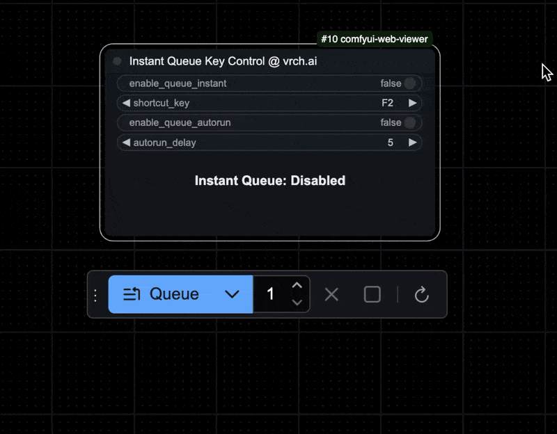

### Node: `INT Key Control @ vrch.ai` (vrch.ai/control/keyboard)

1. **Add the `INT Key Control @ vrch.ai` to your ComfyUI workflow.**
2. **Configure the Node:**
   - **Minimum Value (`min_value`):** Set the minimum allowable integer value (integer between `-9999` and `9999`). Default is `0`.
   - **Maximum Value (`max_value`):** Set the maximum allowable integer value (integer between `-9999` and `9999`). Default is `100`.
   - **Step Size (`step_size`):** Set the increment/decrement value (integer between `1-10`). Default is `1`.
   - **Shortcut Key 1 (`shortcut_key1`):** Select a key from `F1` to `F12` to serve as the primary shortcut key. Default is `F2`.
   - **Shortcut Key 2 (`shortcut_key2`):** Choose between `"Down/Up"` or `"Left/Right"` to determine the direction keys. Default is `"Down/Up"`.
   - **Current Value (`current_value`):** Set the initial integer value within the specified range (integer between `-9999` and `9999`). Default is `50`.
3. **Control Integer Value:**
   - **Incrementing:**
     - Press and hold the selected `shortcut_key1` (e.g., `F2`).
     - While holding `shortcut_key1`, press `ArrowUp` or `ArrowRight` to increment.
     - The `current_value` will increase by `step_size` each time, up to the defined `max_value`.
   - **Decrementing:**
     - Press and hold the selected `shortcut_key1` (e.g., `F2`).
     - While holding `shortcut_key1`, press `ArrowDown` or `ArrowLeft` to decrement.
     - The `current_value` will decrease by `step_size` each time, down to the defined `min_value`.
4. **Display and Output:**
   - The current integer value is displayed within the node's UI.
   - Use the `INT` output to connect the integer value to other nodes in your workflow.

**Note:** 
- Ensure that the ComfyUI window/tab is focused when using keyboard shortcuts.
- Prevent browser-specific shortcuts from interfering with the node's functionality.
- Modified `min_value`, `max_value`, and `step_size` values persist across page reloads.
- The `current_value` will always stay within the defined `min_value` and `max_value` boundaries, regardless of user interactions.

---

### Node: `FLOAT Key Control @ vrch.ai` (vrch.ai/control/keyboard)

1. **Add the `FLOAT Key Control @ vrch.ai` to your ComfyUI workflow.**
2. **Configure the Node:**
   - **Step Size (`step_size`):** Set the increment/decrement value (float between `0.01-0.10`). Default is `0.01`.
   - **Shortcut Key 1 (`shortcut_key1`):** Select a key from `F1` to `F12` to serve as the primary shortcut key. Default is `F1`.
   - **Shortcut Key 2 (`shortcut_key2`):** Choose between `"Down/Up"` or `"Left/Right"` to determine the direction keys. Default is `"Down/Up"`.
   - **Current Value (`current_value`):** Set the initial floating-point value (between `0.0-1.0`). Default is `0.50`.
3. **Control Floating-Point Value:**
   - **Incrementing:**
     - Press and hold the selected `shortcut_key1` (e.g., `F1`).
     - While holding `shortcut_key1`, press the corresponding direction key based on `shortcut_key2`:
       - If `"Down/Up"`: Press `ArrowUp` to increment.
       - If `"Left/Right"`: Press `ArrowLeft` to increment.
     - The `current_value` will increase by `step_size` each time, up to a maximum of `1.0`.
   - **Decrementing:**
     - Press and hold the selected `shortcut_key1` (e.g., `F1`).
     - While holding `shortcut_key1`, press the corresponding direction key based on `shortcut_key2`:
       - If `"Down/Up"`: Press `ArrowDown` to decrement.
       - If `"Left/Right"`: Press `ArrowRight` to decrement.
     - The `current_value` will decrease by `step_size` each time, down to a minimum of `0.0`.
4. **Display and Output:**
   - The current floating-point value is displayed within the node's UI.
   - Use the `FLOAT` output to connect the floating-point value to other nodes in your workflow.

**Note:** Ensure that the ComfyUI window/tab is focused when using keyboard shortcuts. Prevent browser-specific shortcuts from interfering with the node's functionality.

---

### Node: `BOOLEAN Key Control @ vrch.ai` (vrch.ai/control/keyboard)

1. **Add the `BOOLEAN Key Control @ vrch.ai` to your ComfyUI workflow.**
2. **Configure the Node:**
   - **Shortcut Key (`shortcut_key`):** Select a key from `F1` to `F12` to serve as the toggle shortcut. Default is `F1`.
   - **Current Value (`current_value`):** Set the initial boolean value (`True`/`False`). Default is `False`.
3. **Toggle Boolean Value:**
   - **Using Shortcut Key:**
     - Press the selected `shortcut_key` (e.g., `F1`) to toggle the `current_value` between `True` and `False`.
     - Each press of the `shortcut_key` will switch the state.
4. **Display and Output:**
   - The current boolean value is displayed within the node's UI.
   - Use the `BOOL` output to connect the boolean value to other nodes in your workflow.

**Note:** Ensure that the ComfyUI window/tab is focused when using the shortcut key. Prevent browser-specific shortcuts from interfering with the node's functionality.

---

### Node: `TEXT Key Control @ vrch.ai` (vrch.ai/control/keyboard)

1. **Add the `TEXT Key Control @ vrch.ai` node to your ComfyUI workflow.**
2. **Configure the Node:**
   - **Text Inputs (`text1` - `text8`):** Enter text for each option. Supports multiple lines. Defaults are empty (`""`).
   - **Jump Empty Option (`skip_empty_option`):** Enable or disable skipping empty text options when cycling. Default is `True`.
   - **Shortcut Key (`shortcut_key`):** Select a function key (`F1` to `F12`) to cycle through texts. Default is `F2`.
   - **Current Value (`current_value`):** Set the initial selection (`1` to `8`). Default is `1`.
3. **Cycle Through Text Options:**
   - **Using Shortcut Key:**
     - Press the selected `shortcut_key` (e.g., `F2`) to cycle through the text options.
     - **With `skip_empty_option` Enabled (`True`):**
       - Skips any empty `text` inputs.
     - **With `skip_empty_option` Disabled (`False`):**
       - Cycles through all texts, including empty ones.
4. **Display and Output:**
   - **Display:**
     - Shows `Value: X`, where `X` is the current selection (`1` to `8`).
   - **Output:**
     - **Type:** `STRING`
     - Outputs the selected text based on `current_value`. Connect to other nodes as needed.

**Note:**  
Ensure the ComfyUI window/tab is focused when using the shortcut key to prevent conflicts with browser shortcuts.

----

### Node: `Instant Queue Key Control @ vrch.ai` (vrch.ai/control/keyboard)

1. **Add the `Instant Queue Key Control @ vrch.ai` to your ComfyUI workflow.**

2. **Configure the Node:**
   - **Enable Queue Instant (`enable_queue_instant`):** Sets the initial state of the instant queue toggle. Default is `False`.
   - **Shortcut Key (`shortcut_key`):** Select a function key (`F1` to `F12`) as the shortcut key to toggle the instant queue functionality on or off. Default is `F2`.
   - **Enable Queue Autorun (`enable_queue_autorun`):** Toggle whether the queue will automatically run after a delay when activated. Default is `False`.
   - **Autorun Delay (`autorun_delay`):** Sets the delay (in seconds) before the queue automatically triggers when `enable_queue_autorun` is enabled. The value ranges from 1 to 60 seconds, with a default of 5 seconds.

3. **Toggle Instant Queue:**
   - **Using Shortcut Key:**
     - Pressing the chosen `shortcut_key` (e.g., `F2`) toggles the `enable_queue_instant` state between **Enabled** and **Disabled**.
     - Each press of the shortcut key switches the state, allowing for easy control over the instant queue function without manually adjusting the `enable_queue_instant` setting.

4. **Display and Output:**
   - The node displays the current status of the instant queue (either **Enabled** or **Disabled**) within its UI.
   - If `enable_queue_autorun` is enabled, a countdown timer displays the time remaining until the queue runs, updating every second.
   - No additional outputs are provided, as this node functions solely as a control toggle within the workflow.

5. **Interruptible Countdown:**
   - If the queue is re-triggered during an active countdown, the existing countdown will reset, and a new countdown will start from the configured `autorun_delay` time. This ensures only one activation cycle runs at a time.

**Note:**  
Ensure the ComfyUI window/tab is focused when using the shortcut key to avoid conflicts with browser-specific shortcuts or system key bindings.

--- 
