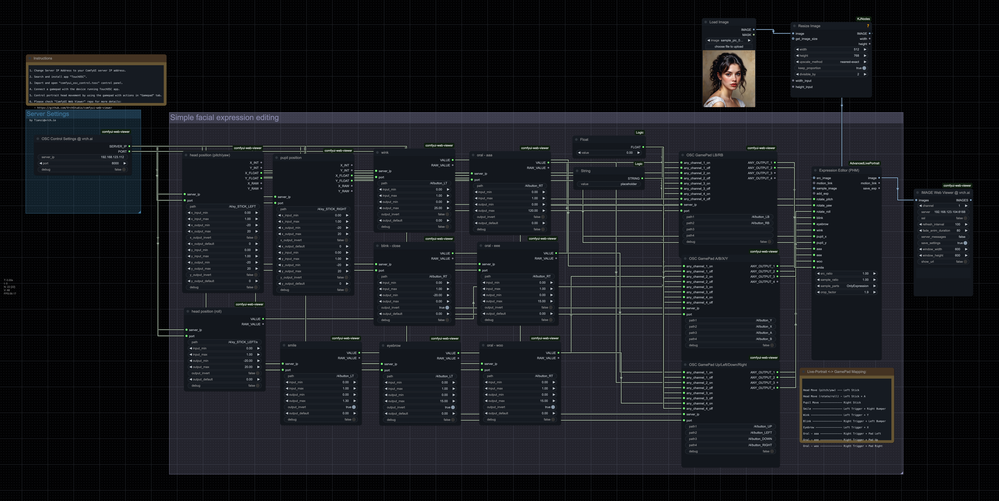

## TL;DR

If you saw the [last post on real-time avatar control with ComfyUI and Vision Pro](https://www.reddit.com/r/comfyui/comments/1fyokln/update_realtime_avatar_control_with_comfyui_and/), here’s the next piece: a fully open-source guide to adding gamepad integration. 🎮

With this setup, you can use your gamepad to control live portrait movements and expressions in ComfyUI. It’s all about bringing that next level of interactive control into your setup—perfect for adding expressions, head movement, and more to your avatar with just a joystick and buttons. Follow along and give it a try!



## Preparations

1. Install `ComfyUI Web Viewer` custome node: 
   - Method 1: search for `ComfyUI Web Viewer` in ComfyUI Manager
   - Method 2: install from github: [https://github.com/VrchStudio/comfyui-web-viewer](https://github.com/VrchStudio/comfyui-web-viewer)
2. Install `Advanced Live Portrait` custome node: 
   - Method 1: search for `ComfyUI-AdvancedLivePortrait` in ComfyUI Manager
   - Method 2: install from github: [https://github.com/PowerHouseMan/ComfyUI-AdvancedLivePortrait](https://github.com/PowerHouseMan/ComfyUI-AdvancedLivePortrait)
3. Download `Workflow Example: Live Portrait + Gamepad` workflow:
   - Download it from here: [example_osc_control_002_live_portrait_with_gamepad.json](https://github.com/VrchStudio/comfyui-web-viewer/blob/main/example_workflows/example_osc_control_002_live_portrait_with_gamepad.json)
4. Install `TouchOSC` app
   - AppStore: [https://apps.apple.com/us/app/touchosc/id1569996730](https://apps.apple.com/us/app/touchosc/id1569996730)
   - Official Website: [https://hexler.net/touchosc](https://hexler.net/touchosc)
5. Download `comfyui_osc_control.tosc` comfyui osc control panel in `TouchOSC` app
   - Download it from here: [comfyui_osc_control.tosc](https://github.com/VrchStudio/comfyui-web-viewer/blob/main/assets/touchosc/comfyui_osc_control.tosc)

## How to play

### Using Gamepad in TouchOSC App

1. **Connect Your Gamepad**: Connect your gamepad to the device running the `TouchOSC` app (usually through Bluetooth).
2. **Open TouchOSC**: Open `TouchOSC` app on your device.
3. **Set Up Connections in TouchOSC**:  
   - Go to **Connections** settings in `TouchOSC` app.
   - For **OSC**, enter your ComfyUI server’s IP address (e.g., `192.168.1.100:8000`).
   - For **Gamepad**, enable the Gamepad connection feature.
4. **Import the OSC Control Panel File**: Add the [comfyui_osc_control.tosc](https://github.com/VrchStudio/comfyui-web-viewer/blob/main/assets/touchosc/comfyui_osc_control.tosc) file into `TouchOSC`.
5. **Run the Control Panel**:  
   - In the `TouchOSC` app, open the `comfyui_osc_control` panel.
   - Go to the `Gamepad` tab.
6. **Test Your Setup**: Try using your gamepad to control the buttons in `TouchOSC`. If it works, you’re all set!

### Run Workflow in ComfyUI

1. **Load Workflow**
   - In ComfyUI, load the file [example_osc_control_002_live_portrait_with_gamepad.json](https://github.com/VrchStudio/comfyui-web-viewer/blob/main/example_workflows/example_osc_control_002_live_portrait_with_gamepad.json)
2. **Set Server Address**
   - Go to `Server Settings` group panel
   - Update `Server Address` to your ComfyUI Server IP address, e.g. `192.168.1.100`
3. **Select Portrait Image**
   - You could use [sample_pic_01_woman_head.png](https://raw.githubusercontent.com/VrchStudio/comfyui-web-viewer/refs/heads/main/assets/images/sample_pic_01_woman_head.png) as an example portait to control
4. **Enable Auto Queue**
   - Enable and select `Extra options` -> `Auto Queue` -> `instant`
5. **Run Workflow**
   - Press `Queue Prompt` button to start executing the workflow
   - Click `[Open Web Viewer]` button to view the portrait in a separate window
6. **Use Your Gamepad**
   - Grab your gamepad and enjoy controlling the portrait with it!

### Cheat Code

```
Head Move (pitch/yaw) --- Left Stick
Head Move (rotate/roll) - Left Stick + A
Pupil Move -------------- Right Stick
Smile ------------------- Left Trigger + Right Bumper
Wink -------------------- Left Trigger + Y
Blink ------------------- Right Trigger + Left Bumper
Eyebrow ----------------- Left Trigger + X
Oral - aaa -------------- Right Trigger + Pad Left
Oral - eee -------------- Right Trigger + Pad Up
Oral - woo -------------- Right Trigger + Pad Right
```

### Advanced Tips

1. If you are an expert on OSC communcation protocol, you may change / update / add more OSC controls by using the `OSC Control nodes` in `ComfyUI Web Viewer` ComfyUI custome node.


## Materials

- ComfyUI workflow: [example_osc_control_002_live_portrait_with_gamepad.json](https://github.com/VrchStudio/comfyui-web-viewer/blob/main/example_workflows/example_osc_control_002_live_portrait_with_gamepad.json)
- TouchOSC panel file: [comfyui_osc_control.tosc](https://github.com/VrchStudio/comfyui-web-viewer/blob/main/assets/touchosc/comfyui_osc_control.tosc)
- Sample portrait picture: [sample_pic_01_woman_head.png](https://raw.githubusercontent.com/VrchStudio/comfyui-web-viewer/refs/heads/main/assets/images/sample_pic_01_woman_head.png)