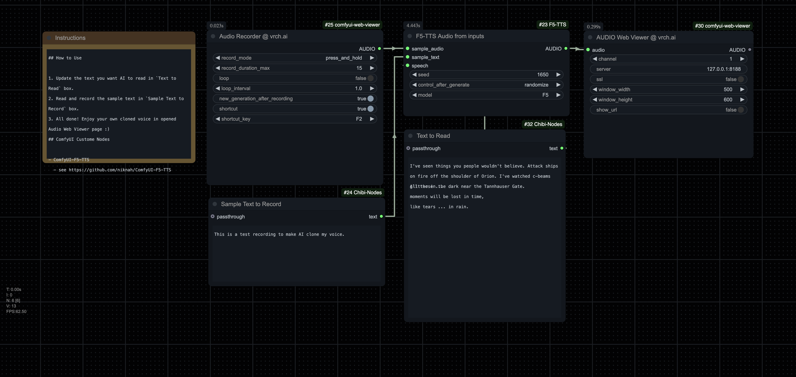

# Tutorial 004: Real Time Voice Clone by F5-TTS

You can **[Download the Workflow Here](https://github.com/VrchStudio/comfyui-web-viewer/blob/main/workflows/example_web_viewer_005_audio_web_viewer_f5_tts.json)**

## TL;DR

- **Effortlessly Clone Your Voice in Real-Time**: Utilize the power of F5-TTS integrated with ComfyUI to create a high-quality voice clone with just a few clicks.
- **Simple Setup**: Install the necessary custom nodes, download the provided workflow, and get started within minutes without any complex configurations.
- **Interactive Voice Recording**: Use the `Audio Recorder @ vrch.ai` node to easily record your voice, which is then automatically processed by the F5-TTS model.
- **Instant Playback**: Listen to your cloned voice immediately through the `Audio Web Viewer @ vrch.ai` node.
- **Versatile Applications**: Perfect for creating personalized voice assistants, dubbing content, or experimenting with AI-driven voice technologies.

---

## Preparations

### Install Main Custom Nodes

1. **ComfyUI-F5-TTS**  
   - Simply search and install **"ComfyUI-F5-TTS"** in ComfyUI Manager.  
   - See [https://github.com/niknah/ComfyUI-F5-TTS](https://github.com/niknah/ComfyUI-F5-TTS)

2. **ComfyUI-Web-Viewer**  
   - Simply search and install **"ComfyUI Web Viewer"** in ComfyUI Manager.  
   - See [https://github.com/VrchStudio/comfyui-web-viewer](https://github.com/VrchStudio/comfyui-web-viewer)

### Install Other Necessary Custom Nodes

- **ComfyUI Chibi Nodes**  
  - Simply search and install **"ComfyUI-Chibi-Nodes"** in ComfyUI Manager.
  - see [https://github.com/chibiace/ComfyUI-Chibi-Nodes](https://github.com/chibiace/ComfyUI-Chibi-Nodes)

---

## How to Use

### 1. Run Workflow in ComfyUI

1. **Open the Workflow**  
   - Import the [example_web_viewer_005_audio_web_viewer_f5_tts](https://github.com/VrchStudio/comfyui-web-viewer/blob/main/workflows/example_web_viewer_005_audio_web_viewer_f5_tts.json) workflow into ComfyUI.

2. **Record Your Voice**  
   - In the **`Audio Recorder @ vrch.ai`** node:
     - Press and hold the **[Press and Hold to Record]** button.
     - Read aloud the text in `Sample Text to Record` (for example):
       > This is a test recording to make AI clone my voice.
     - Your recorded voice will be automatically sent to the **`F5-TTS`** node for processing.

3. **Trigger the TTS**  
   - If the process doesn’t start automatically, click the **[Queue]** button in the **`F5-TTS`** node.
   - Enter custom text in the `Text To Read` field, such as:
     > I've seen things you people wouldn't believe. Attack ships on fire off the shoulder of Orion. I've watched c-beams glitter in the dark near the Tannhauser Gate.  
     > All those ...  
     > moments will be lost in time,  
     > like tears ... in rain.

4. **Listen to Your Cloned Voice**  
   - The text in the **`Text To Read`** node will be read aloud by the AI using your cloned voice.

5. **Enjoy the Result!**  
   - Experiment with different phrases or voices to see how well the model clones your tone and style.

### 2. Use Your Cloned Voice Outside of ComfyUI

The **`Audio Web Viewer @ vrch.ai`** node from the [**ComfyUI Web Viewer**](https://github.com/VrchStudio/comfyui-web-viewer) plugin makes it simple to showcase your cloned voice or share it with others.

1. **Open the Audio Web Viewer page**:
   - In the **`Audio Web Viewer @ vrch.ai`** node, click the **[Open Web Viewer]** button.
   - A new browser window (or tab) will open, playing your cloned voice.

2. **Accessing Saved Audio**:
   - The `.mp3` file is stored in your ComfyUI `output` folder, within the `web_viewer` subfolder (e.g., `web_viewer/channel_1.mp3`).
   - Share this file or open the generated URL from any device on your network (if your server is accessible externally).

> **Tips:** Make sure your **Server** address and **SSL** settings in `Audio Web Viewer` are correct for your network environment. If you want to access the audio from another device or over the internet, ensure that the server IP/domain is reachable and ports are open.

---

## References

- **Real Time Voice Clone Workflow**:  
  [example_web_viewer_005_audio_web_viewer_f5_tts](https://github.com/VrchStudio/comfyui-web-viewer/blob/main/workflows/example_web_viewer_005_audio_web_viewer_f5_tts.json)
- **ComfyUI Web Viewer GitHub Repo**:  
  [https://github.com/VrchStudio/comfyui-web-viewer](https://github.com/VrchStudio/comfyui-web-viewer)
- **ComfyUI F5 TTS GitHub Repo**:  
  [https://github.com/niknah/ComfyUI-F5-TTS](https://github.com/niknah/ComfyUI-F5-TTS)
- **F5-TTS GitHub Repo**:
  [https://github.com/SWivid/F5-TTS/](https://github.com/SWivid/F5-TTS/)